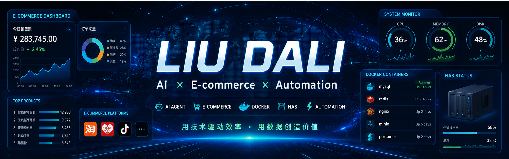

  

---

| 🛒 限时热卖 | 🔥 热销爆款 | ✨ 新品上市 | ⭐ 五星好评 | 🎁 七日大优惠 |
|:---:|:---:|:---:|:---:|:---:|
| 代码自动机 | AI Agent | ComfyUI | 品质保证 | 永久售后 |

---

<h1 align="center">🚀 刘大利 · Liu Dali</h1>

  

| 🛒 电商运营 | 🤖 AI Agent | 🐳 Docker/NAS | 🎨 ComfyUI | ⚡ 效率工具 |
|:---:|:---:|:---:|:---:|:---:|
| 自动化提效 | 多Agent协同 | 私有化部署 | AI绘图视频 | 日常提效 |

  

---

## 🏪 商品分类 · Categories

| 🐍 Python | 🐳 Docker | 🐧 Linux | 🌐 Node.js | 💚 Vue | 🔀 Nginx |
|:---:|:---:|:---:|:---:|:---:|:---:|
| 全栈开发 | 容器编排 | 私有NAS | API服务 | 前端框架 | 反向代理 |

---

## 📦 热销商品 · Hot Products

| 🏆 排行 | 📦 商品名称 | 📝 商品描述 | 💰 销量 |
|:---:|:---|:---|:---:|
| 🥇 | AI-Agent | 多Agent自动化系统 | ⭐ 52k+ |
| 🥈 | E-commerce Toolkit | 电商运营工具 | ⭐ 12k+ |
| 🥉 | ComfyUI Workflows | AI工作流合集 | ⭐ 8k+ |
| 4️⃣ | NAS Toolkit | Docker运维工具 | ⭐ 5k+ |
| 5️⃣ | Browser Cluster | 浏览器矩阵管理 | ⭐ 3k+ |

---

## 🚀 今日推荐 · Current Focus

| 🤖 AI Agent工作流 | 🛒 电商自动化 | 🐳 NAS平台 | 🎨 ComfyUI |
|:---:|:---:|:---:|:---:|
| 多Agent协同·降本增效 | 运营自动化·效率翻倍 | 飞牛NAS·服务编排 | AI绘图·视频工作流 |

---

## 📊 店铺数据 · Stats

  
  

---

## 🔥 连续出勤 · Streak

  

---

## 🐍 贡献蛇 · Contribution Snake

  

---

## 🎯 店铺承诺 · Guarantees

| ✅ 品质保证 | 🚀 极速响应 | 💎 永久售后 |
|:---:|:---:|:---:|
| 代码规范·类型安全 | Issue 24h内处理 | 长期维护更新 |

---

## 📮 联系客服 · Contact

  
  

---

  
  
  

---

  
   
  <i>© 2025 liudali333 Code Store · 让代码更有价值</i>

